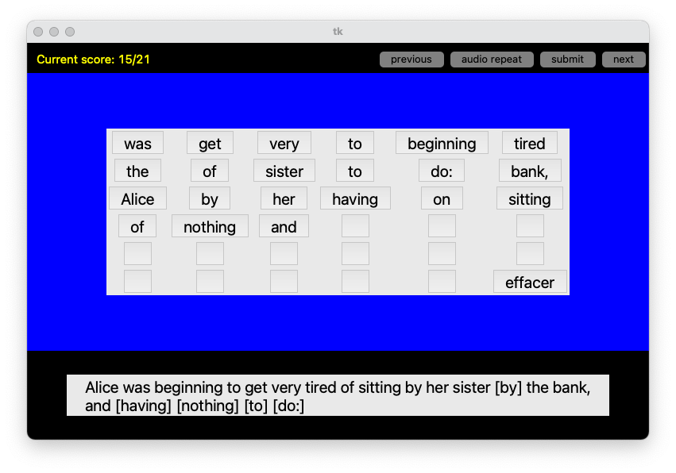

As a [cochlear implant](https://en.wikipedia.org/wiki/Cochlear_implant) user, I need to practice my listening to get used to the sound from the implant. 
This is called auditory rehabilitation. Inspired by another app called [AngleSound](http://angelsound.tigerspeech.com/), 
which contains an extensive collection of practices, but most of them are more for pediatric users, I had this
idea to design an app that could benefit deaf adults with existing language abilities (yeah I know how that
could sound like an oxymoron). In this app, the user is asked to reshuffle spoken sentence fragments by 
listening to a short audio clip and then reorder the provided words to match what is spoken in the audio
clip. 

As a demo, I have preprocessed the first chapter of one of my favorite books, Alice in Wonderland, to produce 
174 spoken fragments with their corresponding aligned transcripts. These resource files are deposited in
the repo and will be loaded by the python app once started. The requirements for installing the app is minimal.
Please just use pip or conda to install the `playsound` package or replace its occurence in my demo code by any 
other package that can load and play mp3 files. 

The raw text for the transcript is generously provided by [Project Gutenberg](https://www.gutenberg.org/). Raw audio
files are generously provided by [LibriVox](https://librivox.org/). The app is smashed together in hours using tkinter,
Python's standard GUI toolkit. The preprocessing of raw audio and transcript, including automatic segmentation at pauses
and alignment of transcript to audio clips, are done with [librosa](https://librosa.org/doc/latest/index.html) and 
[TorchAudio](https://pytorch.org/audio/stable/index.html)'s pretrained wav2vec model. Code may be released upon sufficient
interest. The preprocessing pipeline can be applied to any spoken material in English with minimal background noise. 
Effectiveness in case of speaker diarization has not been tested. 

Please reach out to me at ziyuanzhao@college.harvard.edu if you are interested in the project, thanks!

A picture is worth a thousand words - here's a screenshot:

